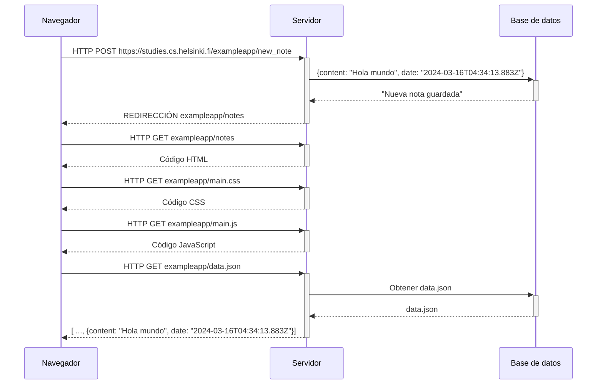

# DIAGRAMA DE SECUENCIA DE NUEVA NOTA

```mermaid
sequenceDiagram
    participant Navegador
    participant Servidor
    participant Base de datos
    

    Navegador->>+Servidor: HTTP POST https://studies.cs.helsinki.fi/exampleapp/new_note
    Servidor->>+Base de datos: {content: "Hola mundo", date: "2024-03-16T04:34:13.883Z"}
    Base de datos-->>-Servidor: "Nueva nota guardada"
    Servidor-->>-Navegador: REDIRECCIÓN exampleapp/notes
    Navegador->>+Servidor: HTTP GET exampleapp/notes
    Servidor-->>-Navegador: Código HTML
    Navegador->>+Servidor: HTTP GET exampleapp/main.css
    Servidor-->>-Navegador: Código CSS
    Navegador->>+Servidor: HTTP GET exampleapp/main.js
    Servidor-->>-Navegador: Código JavaScript
    Navegador->>+Servidor: HTTP GET exampleapp/data.json
    Servidor->>+Base de datos: Obtener data.json
    Base de datos-->>-Servidor: data.json
    
    Servidor-->>-Navegador: [ ..., {content: "Hola mundo", date: "2024-03-16T04:34:13.883Z"}]
    
    
```